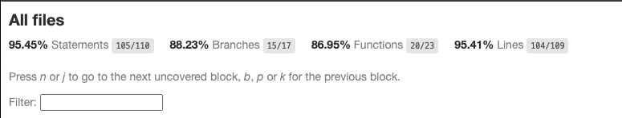
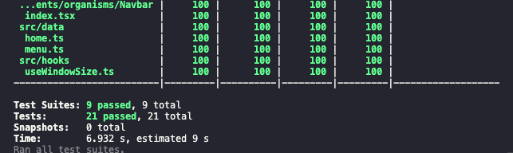

<h1 align="center">
  Desafio Técnico - The Brookley Brothers
<br />  
</h1>
 <p align="center"> <strong> Objetivo: Implementar o layout de uma página responsiva utilizando React, Sass ou CSS, conforme as especificações fornecidas no Figma. </strong> </p>

##  :notebook_with_decorative_cover: Instruções
```git clone https://github.com/leandrohl/tbb-frontend-testing.git ``` : para clonar o repositório do projeto
<br />
```npm install ``` : para a instalação das dependências
<br />
```npm run dev ``` : executar a aplicação frontend
<br />
```npm run test ``` : executar testes unitários

##  :computer: Tecnologias utilizadas
- **React Js** — Biblioteca JavaScript para criação de interfaces de usuário dinâmicas.
- **Vite** — Ferramenta de desenvolvimento frontend ultrarrápida baseada em JavaScript e TypeScript.
- **Typesript** — Extensão do JavaScript com tipos estáticos opcionais para detecção precoce de erros.
- **Sass** — Linguagem de folha de estilo CSS com recursos avançados como variáveis e aninhamento.
- **Jest e Testing Library** — Framework e coleção de ferramentas para testes unitários focados no comportamento do usuário final.
- **Husky** — Ferramenta para configurar ganchos de Git para automatizar tarefas de pré-commit e pré-push.
- **ESLint** - Ferramenta que ajuda a identificar e corrigir problemas de estilo e erros no código, promovendo boas práticas de codificação.
- **Atomic Design** - Metodologia de design que quebra interfaces em componentes menores e independentes, promovendo reutilização e consistência em todo o sistema.

## :rocket: Projeto


## :bar_chart: Testes unitários




## :notebook: Requisitos para avaliação:
- Layout da Página: Implementar o layout da página conforme as especificações no Figma.
- Menu: Incluir funcionalidade e animações do menu conforme as orientações fornecidas no Figma.
- Garantir que o menu seja responsivo e funcional em ambas as versões (mobile e desktop).
- Tecnologias: Utilizar React para a implementação da página.
- Responsividade: A página deve ser completamente responsiva, adaptando-se a diferentes tamanhos de tela.
- Repositório:Criar um repositório no GIT para armazenar o código fonte.
- Incluir um arquivo README.md no repositório com instruções sobre como executar o teste.

## :art: Figma
- Figma Mobile para a versão mobile da página. ([Link](https://www.figma.com/proto/rtGhSAFFS4Im4VthE0I5pM/Front-end-testing-(LEGO)?type=design&node-id=366-16085&t=b6eVTQZBfVkXDT63-0&scaling=scale-down&page-id=64%3A302&starting-point-node-id=366%3A16085))
- Figma Desktop para a versão desktop da página.([Link](https://www.figma.com/proto/rtGhSAFFS4Im4VthE0I5pM/Front-end-testing-(LEGO)?type=design&node-id=1205-9489&t=DgGJgALptLNhaIRH-0&scaling=scale-down&page-id=0%3A1&starting-point-node-id=1205%3A9489))
- Detalhes adicionais no modo de inspeção do Figma. ([Link](https://www.figma.com/file/rtGhSAFFS4Im4VthE0I5pM/Front-end-testing-(LEGO)?type=design&node-id=0-1&mode=design&t=b6eVTQZBfVkXDT63-0))

